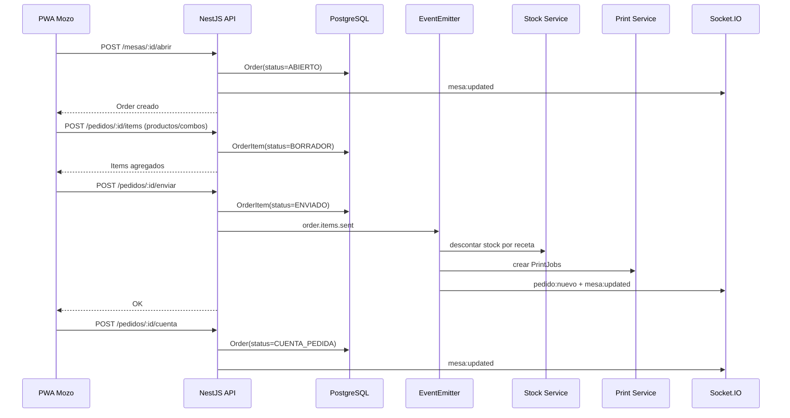
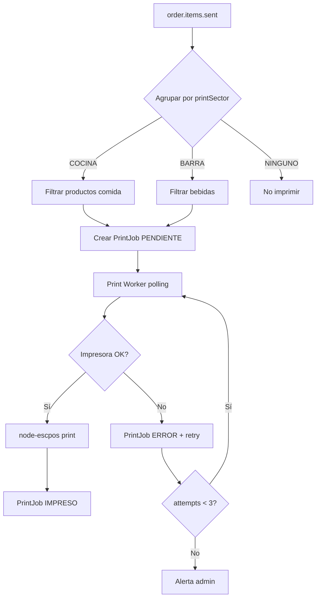
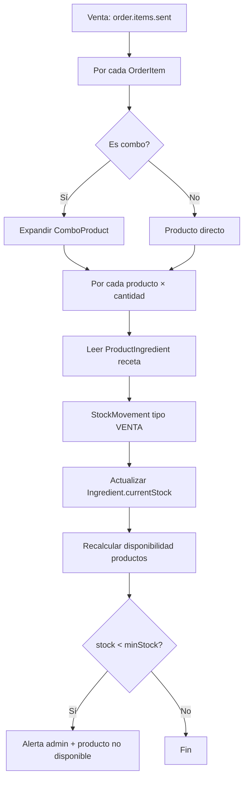

# Flujos de negocio — SistemaBar

## 1. Flujo de pedidos



### Estados de Order

```
ABIERTO → ENVIADO → CUENTA_PEDIDA → CERRADO
                  ↘ CANCELADO (solo admin, antes de cobrar)
```

### Estados de OrderItem

```
BORRADOR → ENVIADO → (opcional: EN_PREPARACION → LISTO → SERVIDO)
         ↘ CANCELADO (antes de enviar, o anulación admin)
```

### Reglas de negocio

1. **Borrador vs enviado:** solo los ítems `ENVIADO` descuentan stock e imprimen.
2. **Combos:** al enviar, se expanden a productos internos; cada producto aplica su receta.
3. **Modificar cantidad:** solo en `BORRADOR`. Enviados requieren anulación + nuevo ítem (auditoría).
4. **Precio congelado:** `unitPrice` se guarda al agregar el ítem (cambios de carta no afectan pedidos abiertos).
5. **Una mesa = una orden activa** (`ABIERTO` | `ENVIADO` | `CUENTA_PEDIDA`).

---

## 2. Flujo de impresión



### Contenido del ticket (cocina)

```
================================
        COCINA - MESA 5
================================
Pedido #142        20/05 14:32
Mozo: Juan
--------------------------------
2x Doble Cheese
   - Sin cebolla
1x Papas Grandes
--------------------------------
```

### Print Worker (proceso separado)

- Corre en el mismo contenedor o como servicio `print-worker` en Docker Compose.
- Poll cada 2s: `SELECT * FROM print_jobs WHERE status = 'PENDIENTE' ORDER BY created_at`.
- Lock optimista: `UPDATE ... WHERE status = 'PENDIENTE'` antes de imprimir.
- Persistencia garantiza que un reinicio no pierde trabajos.

### Sectores de impresión

| Sector | Productos | Impresora |
|--------|-----------|-----------|
| `COCINA` | Hamburguesas, pizzas, papas, postres | IP red local |
| `BARRA` | Bebidas, tragos | IP red local |
| `NINGUNO` | Servicio de mesa, cubiertos | — |

---

## 3. Flujo de stock



### Tipos de StockMovement

| Tipo | Cuándo | quantity |
|------|--------|----------|
| `ENTRADA` | Compra / reposición manual | positivo |
| `SALIDA` | Merma / vencimiento | negativo |
| `AJUSTE` | Inventario físico | delta |
| `VENTA` | Pedido enviado | negativo (por receta) |
| `ANULACION` | Cancelación post-envío (admin) | positivo (reversa) |

### Disponibilidad automática

Para cada producto con receta:

```
available = manualAvailable AND ∀ ingrediente: 
  ingredient.currentStock >= recipe.quantity × 1
```

- Se recalcula tras cada `StockMovement` que afecte un ingrediente usado en recetas.
- Se persiste en `Product.autoAvailable` (cache) + se emite `producto:disponibilidad`.
- El mozo ve productos no disponibles deshabilitados en la UI.

### Ejemplo concreto

**Doble Cheese** requiere: Pan×1, Medallón×2, Cheddar×4.

Si `Pan.currentStock = 0`:
- `Doble Cheese.autoAvailable = false`
- Todos los combos que incluyen Doble Cheese también quedan no disponibles (validación en backend al agregar combo).

---

## 4. Flujo de caja

```
1. Caja ve mesas con status CUENTA_PEDIDA (WS + REST)
2. GET /pedidos/:id/resumen → ítems, total, descuentos (futuro)
3. POST /caja/cobrar
   - body: { orderId, payments: [{ method, amount }] }
   - validar sum(payments) >= total
   - crear Payment + PaymentLines
   - Order.status = CERRADO
   - Table.status = LIBRE
   - emit payment.completed
4. POST /caja/tickets/:paymentId/reimprimir → nuevo PrintJob tipo TICKET_CLIENTE
```

---

## 5. Flujo de autenticación

```
POST /auth/login { username, password }
  → validar bcrypt
  → JWT { sub, role, branchId }
  → refresh token en DB (opcional MVP: solo access token)

Todas las rutas protegidas: JwtAuthGuard + RolesGuard
WebSocket: validar JWT en connection handshake
```

---

## 6. Preparación QR / Delivery (futuro)

Campos ya modelados:

```prisma
enum OrderSource {
  SALON      // mozo
  QR         // cliente escanea mesa
  DELIVERY   // app delivery
  TAKEAWAY
}

enum OrderType {
  MESA
  DELIVERY
  RETIRO
}
```

Flujo QR (fase 2):
1. Cliente escanea QR → `tableId` + token público de mesa
2. PWA cliente (solo lectura carta + carrito)
3. `POST /pedidos/qr` con `source: QR` → misma pipeline stock + impresión
4. Mozo recibe notificación WS en la mesa
